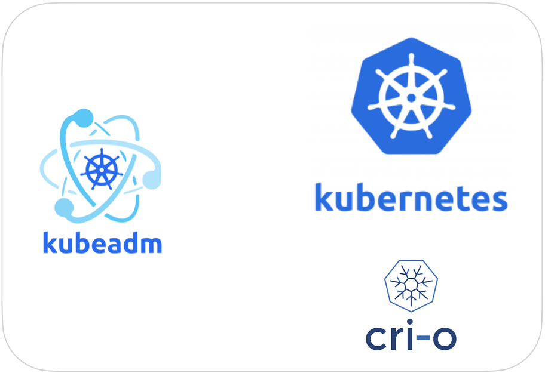

# Installer un cluster k8s avec Kubeadm
 Bienvenue dans notre documentation détaillée sur l'installation d'un cluster Kubernetes étape par étape. Kubernetes, le système d'orchestration de conteneurs open source, est devenu un pilier incontournable pour déployer, gérer et mettre à l'échelle des applications conteneurisées dans des environnements de production
 
 ## Les pré-requis 
1. Au moins 2 Machines Linux (1 master node et 1 worker node)
2. Master :  2 vCPU et 2 GB de RAM
3. Worker: 1vCPU et 2 GB de RAM
4. Interco entre les VM
5. Accès internet des VM

## Les etapes de l'installation
### Pré-requis sur les VM
1.  Activation sur le systèmes de modules  (overlay, br_netfilter)
2.  Configuration iptables pour le bridged network
3.  Desactivation swap sur les noeuds
### Installation du cluster
1. Installation du container runtime 					**[All nodes]**
1. Installation de Kubeadm, Kubelet et Kubectl			**[All nodes]**
1. Initialisation et configuration du Control Pane			**[Master node]**
1. Installation du plugin réseaux						**[k8s]**
1. Connection des worker au master node				**[Worker nodes]**
1. Installer Metrics Server							**[k8s]**
1. Mettre la configuration sur son poste local pour se connecter au server **[locel]**
1. Installer une application nginx					**[k8s]**

## Procédure d'installation

Ci-dessous vous aurez les commandes à lancer sur vos VM
### Activation sur le systèmes de modules  (overlay, br_netfilter)
```bash
sudo nano /etc/modules-load.d/k8s.conf

# coller le contenu ci-dessous
overlay
br_netfilter

# puis executer 
sudo modprobe overlay
sudo modprobe br_netfilter
```

### Configuration iptables pour le bridged network

```bash
sudo nano /etc/sysctl.d/k8s.conf

# coller le contenu ci-dessous
net.bridge.bridge-nf-call-iptables  = 1
net.bridge.bridge-nf-call-ip6tables = 1
net.ipv4.ip_forward                 = 1

# puis executer
sudo sysctl --system
```

###  Desactivation swap sur les noeuds
```bash
sudo swapoff -a
(crontab -l 2>/dev/null; echo "@reboot /sbin/swapoff -a") | crontab - || true
```

### Installation du container runtime CRI-O

```bash
sudo -s # mettre le mot de passe pour se connecter en tant que root
0S="Debian_11"
VERSION="1.28"

echo "deb [signed-by=/usr/share/keyrings/libcontainers-archive-keyring.gpg] https://download.opensuse.org/repositories/devel:/kubic:/libcontainers:/stable/$OS/ /" > /etc/apt/sources.list.d/devel:kubic:libcontainers:stable.list
echo "deb [signed-by=/usr/share/keyrings/libcontainers-crio-archive-keyring.gpg] https://download.opensuse.org/repositories/devel:/kubic:/libcontainers:/stable:/cri-o:/$VERSION/$OS/ /" > /etc/apt/sources.list.d/devel:kubic:libcontainers:stable:cri-o:$VERSION.list

mkdir -p /usr/share/keyrings
curl -L https://download.opensuse.org/repositories/devel:/kubic:/libcontainers:/stable/$OS/Release.key | gpg --dearmor -o /usr/share/keyrings/libcontainers-archive-keyring.gpg
curl -L https://download.opensuse.org/repositories/devel:/kubic:/libcontainers:/stable:/cri-o:/$VERSION/$OS/Release.key | gpg --dearmor -o /usr/share/keyrings/libcontainers-crio-archive-keyring.gpg

apt-get update
apt-get install cri-o cri-o-runc

systemctl daemon-reload
systemctl enable crio --now
```

### Installation de Kubeadm, Kubelet et Kubectl

```bash
# toujours en tant que root

apt-get update
apt-get install -y apt-transport-https ca-certificates curl

curl -fsSLo /usr/share/keyrings/kubernetes-archive-keyring.gpg https://dl.k8s.io/apt/doc/apt-key.gpg

echo "deb [signed-by=/usr/share/keyrings/kubernetes-archive-keyring.gpg] https://apt.kubernetes.io/ kubernetes-xenial main" | sudo tee /etc/apt/sources.list.d/kubernetes.list

apt-get update -y
apt-get install -y kubelet kubeadm kubectl
apt-mark hold kubelet kubeadm kubectl # pour eviter qu'il soit mis à jour
```

#### Rajouter son ip sur les argument du kubelet

```bash
ip a
# on copie l'adresse IP
nano /etc/default/kubelet
# et on rajoute le contenu suivant avec l'IP
KUBELET_EXTRA_ARGS=--node-ip=< IP DE LA MACHINE >
```

### Initialiser le control plane [master node uniqument]

```bash
IPADDR="192.168.1.124" # IP du master node ( peut etre un IP publique)
NODENAME=$(hostname -s)
POD_CIDR="192.168.0.0/16"

# faire le kubeadm init
kubeadm init --apiserver-advertise-address=$IPADDR  --apiserver-cert-extra-sans=$IPADDR  --pod-network-cidr=$POD_CIDR --node-name $NODENAME

# Pour avoir la config kubeconfig et faire des kubectl
mkdir -p $HOME/.kube
sudo cp -i /etc/kubernetes/admin.conf $HOME/.kube/config
sudo chown $(id -u):$(id -g) $HOME/.kube/config

# Tester avec 
kubectl cluster-info
```

### Installer le plugin réseau Calico


```bash 
kubectl create -f https://raw.githubusercontent.com/projectcalico/calico/v3.26.1/manifests/tigera-operator.yaml

curl https://raw.githubusercontent.com/projectcalico/calico/v3.26.1/manifests/custom-resources.yaml -O

kubectl create -f custom-resources.yaml
```

### Connecter les worker node au control plane 

```bash 
# si vous avez perdu ou pas enrtegistrer la commande de join, faites : 
kubeadm token create --print-join-command

# Faites un get nodes pour voir qu'il y'a qu'un seul (le master node)
kubectl get nodes -o wide
```

Executez la commande de join sur les worker nodes. Chez moi c'etait :
```bash
kubeadm join 192.168.1.124:6443 --token xxue3o.mivqbcnvo071t10w \
	--discovery-token-ca-cert-hash sha256:f1bccd3ac552800fc33e28bb7bf725bcbfa13f125fa658c14e252c60687abc1c

 # Faites un get nodes pour voir que vos worker ont rejoint le cluster
kubectl get nodes -o wide   
```

### Installer Metrics Server

```bash 
kubectl top nodes
# vous avez l'erreur suivantes 
# error: Metrics API not available
````

```bash 
kubectl apply -f metrics-server.yaml # fichier sur github
# Attendez qq secondes, le temps que le service soit UP
kubectl top nodes
kubectl top pod -n kube-system
```

### Installer Nginx sur le cluster 

```bash
kubectl apply -f testNginx.yaml # Fichier dans le repo github
kubectl get pods -o wide # on devrait avoir 2 pods sur le namespace default
```

tester en allant sur http://ADRESS_IP_DE_WORKER_NODE:32000


